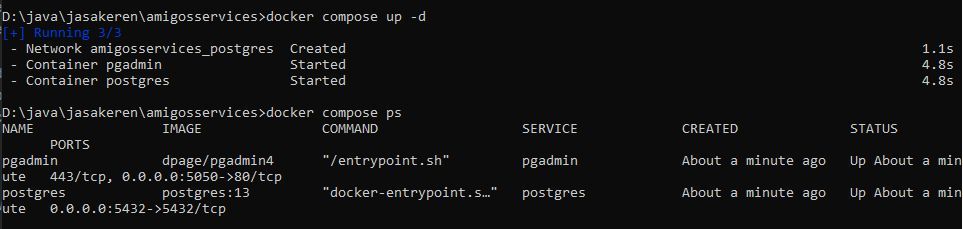
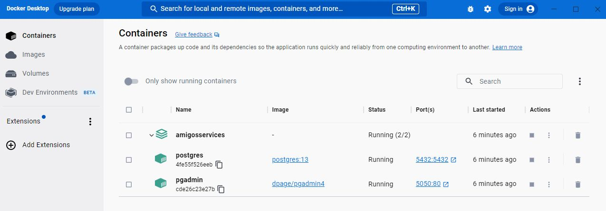
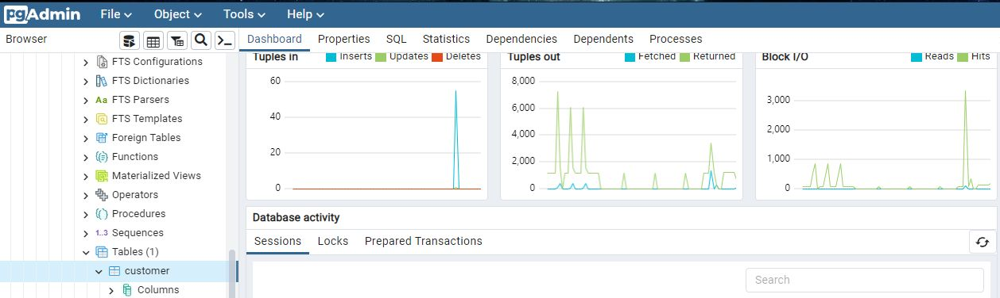
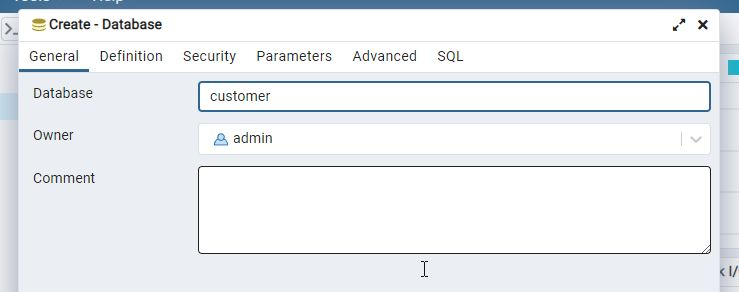

Ini adalah proyek JASAKEREN MEMAKAI Java menggunakan Apache Maven 3.6.. 

Jasakeren adalah proyek coba-coba untuk belajar microservice di JAVA

perintah mvn:
<ol>
<li>mvn archetype:generate -DgroupId=com.wibisono.app -DartifactId=customer -Dversion=1.0-SNAPSHOT -DinteractiveMode=true
<li>mvn archetype:generate -DgroupId=com.amigoscode -DartifactId=amigosservices -DarchetypeArtifactId=maven-archetype-quickstart -DarchetypeVersion=1.4 -DinteractiveMode=false
</ol>

perintah docker:
<ol>
<li>docker compose up -d
<li>docker compose ps
</ol>
 
 
 

sumber belajar:

<a href="https://www.youtube.com/playlist?list=PLwvrYc43l1Mwqpf9i-1B1gXfMeHOm6DeY">Youtube</a>